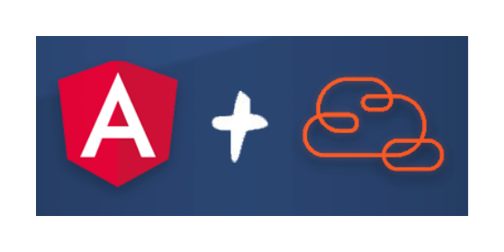

:::{"alert":"primary","title":"About Genesys Cloud Blueprints","autoCollapse":false} 
Genesys Cloud blueprints were built to help you jump-start building an application or integrating with a third-party partner. 
Blueprints are meant to outline how to build and deploy your solutions, not a production-ready turn-key solution.
 
For more details on Genesys Cloud blueprint support and practices 
please see our Genesys Cloud blueprint [FAQ](https://developer.genesys.cloud/blueprints/faq)sheet.
:::

This Genesys Cloud Developer Blueprint demonstrates how to to include the Genesys Cloud Javascript Platform SDK in an Angular project. The blueprint includes a sample Angular project that uses the Genesys Cloud API for supervisor functionalities like searching and setting the status of users. The blueprint also shows how to configure the SDK for a new or existing Angular project.



:::primary
**Note**: If you have an existing Angular project and only want to know how to configure Genesys Cloud SDK in your app, click [here](#configuring-the-angular-project-to-use-genesys-cloud-sdk) to jump to the section.
:::

## Contents

* [Solution components](#solution-components "Goes to the Solutions Components section")
* [Prerequisites](#prerequisites "Goes to the Prerequisites section")
* [Sample Angular app](#sample-angular-app "Goes to the Sample Angular app section")
* [Implementation steps](#implementation-steps "Goes to the Implementation steps section")
* [Additional resources](#additional-resources "Goes to the Additional resources section")

## Solution components

* **Genesys Cloud** - A suite of Genesys cloud services for enterprise-grade communications, collaboration, and contact center management. In this solution, a Genesys Cloud user account is required in order for the Angular app to be authorized to integrate with Genesys Cloud.
* **Angular CLI** - A command line tool that facilitates the use of the Angular development framework for building single-page applications. The sample app in this solution was built with Angular 17 CLI.

### Software development kit (SDK)

* **Genesys Cloud Platfrom API SDK** -  Client libraries used to simplify application integration with Genesys Cloud by handling low-level HTTP requests. In this solution, the SDK authorizes the user and performs the API calls required to execute the supervisor features.

## Prerequisites

### Specialized knowledge

* Administrator-level knowledge of Genesys Cloud
* Experience using the Genesys Cloud Platform API
* Experience using Angular or the Angular CLI 

### Genesys Cloud account requirements

* A Genesys Cloud license. For more information on licensing, see [Genesys Cloud Pricing](https://www.genesys.com/pricing "Goes to the pricing page").
* (Recommended) The Master Admin role in Genesys Cloud. For more information, see [Roles and permissions overview](https://help.mypurecloud.com/?p=24360 "Opens the Roles and permissions overview article") in the Genesys Cloud Resource Center.

## Sample Angular app  

:::primary
**Note**: If you have an existing Angular project and only want to know how to configure Genesys Cloud SDK in your app, see [Implementation steps](#implementation-steps "Goes to the Implementation steps section").
:::

This solution includes a sample Angular app that uses the Genesys Cloud Javascript Platform SDK to display and update data for Genesys Cloud users.


 From the sample Angular app, you can update some user data, and that updated data is returned to Genesys Cloud in real-time. Specifically:

* The **User** page displays data from your Genesys Cloud user account. It also contains a presence-picker component, which allows you to change your presence or routing status.
* The **User Search** page allows you to search for other users in your Genesys Cloud org.  
* The **Queues List** page allows you to see Observation Query details for each queue. Within the Angular app, you can log out all of the agents on a particular queue, which is helpful if those agents cannot log out of their stations after their shift is over.

### Genesys Cloud service

The sample Angular app includes the `genesys-cloud` service, which contains the Genesys Cloud-related functionality that is supported by the Angular app.

All of the API methods return a promise, but if you want to work with observables instead, you can easily convert the promises by using the `from` operator. For example:

```typescript
  getUserDetails(id: string): Observable<platformClient.Models.User> {
    return from(this.usersApi.getUser(id, {
        expand: ['routingStatus', 'presence'],
      }));
  }
```

### Run the sample Angular app hosted in Github

You can run the sample Angular app locally or from the blueprint repo.

:::primary
**Note**: Regardless of where you run the sample Angular app from, you need a Genesys Cloud user account in order for it to work.
:::

To run the sample Angular app from the blueprint repo:

1.  Click [here](https://genesyscloudblueprints.github.io/angular-app-with-genesys-cloud-sdk/ "Goes to the sample Angular app").

2.  If you're on a different region than `us-east-1` (mypurecloud.com), add an `environment` query parameter to the URL and enter your Genesys Cloud environment.

  For example:

  ```bash
  https://genesyscloudblueprints.github.io/angular-app-with-genesys-cloud-sdk/?environment=mypurecloud.com.au
  ```

  For more information, see [Platform API](/api/rest/ "Goes to the Platform API page in the Genesys Cloud Developer Center").


### Run the sample Angular app locally

1. Clone the [blueprint repo](https://github.com/GenesysCloudBlueprints/angular-app-with-genesys-cloud-sdk "Goes to the blueprint repo in Github") to your local machine:

  ```bash
  git clone https://github.com/GenesysCloudBlueprints/angular-app-with-genesys-cloud-sdk.git
  ```

2. Go to the **genesys-cloud-sample** project directory.

  ```bash
  cd genesys-cloud-sample
  ```

3. Modify the client ID and redirect URI values in the environment files.

  i. Go to the **src**>**environments** directory.

  ii. Modify the production `environment.prod.ts` file:

  ```typescript
  export const environment = {
    production: true,
    GENESYS_CLOUD_CLIENT_ID: '<YOUR CLIENT ID HERE>',
    REDIRECT_URI: '<YOUR PRODUCTION URI HERE>',
  };
  ```

  iii. Modify the test `environment.ts:` file:

  ```typescript
  export const environment = {
    production: false,
    GENESYS_CLOUD_CLIENT_ID: '<YOUR CLIENT ID HERE>',
    REDIRECT_URI: 'http://localhost:4200',
  };
  ```

4. Serve the Angular app locally:

  ```bash
  ng serve
  ```

## Implementation steps

Follow these instructions to include the Genesys Cloud Javascript Platform SDK in your own Angular project.

:::primary
**Tip**: Instead of creating a new Angular project, you can use an existing one. However, these instructions assume you're using Angular 12. If you use an earlier version of Angular, you may need to adapt these instructions.
:::

### Create a Token Implicit Grant (Browser) client in Genesys Cloud

1. To authorize your app with the Genesys Cloud SDK, create an Implicit Grant (Browser) client with the following settings:

  * **Authorized redirect URIs (one per line)**:
    * Your production URI
    * `http://localhost:4200/` (to test locally)
  * **Scope**:
    * analytics
    * authorization
    * presence
    * routing
    * users

For more information, see [Create an OAuth client](https://help.mypurecloud.com/articles/create-an-oauth-client/ "Goes to the Create an OAuth client article") in the Genesys Cloud Resource Center.

### Prepare Angular

1. Install the Angular CLI:

  ```bash
  npm install -g @angular/cli
  ```

2. Create a new Angular 12 project:

  ```bash
  ng new name-of-your-app
  ```

### Install NPM packages

1. Install the Genesys Cloud platform client:

  ```bash
  npm install purecloud-platform-client-v2
  ```

2. Install the custom-webpack library:

  ```bash
  npm i @angular-builders/custom-webpack --save-dev
  ```

### Configure the files for use with the Genesys Cloud Javascript Platform SDK

1. In the root of your Angular project, create a file with a meaningful name. For example, `extra-webpack.config.js`

2. Add the following content to the file:

  ```javascript
  module.exports = {
    externals: {
      'purecloud-platform-client-v2': "require('platformClient')",
    },
  }
  ```

3. In the root of the project, open the `angular.json` file and find the `architect` property. Then modify the builder targets, which are found under the `build` property:

    i. Change the builder property to: `@angular-builders/custom-webpack:browser`

    ii. Under the options property, add a new `customWebpackConfig` object. Refer to the following code block for details.

    iii. In the `scripts` property add `node_modules/purecloud-platform-client-v2/dist/web-cjs/purecloud-platform-client-v2.min.js`

    iv. Change the key of the `browser` entry to `main`.

    The modified `build` property should look like this:

     ```json
      "build": {
        "builder": "@angular-builders/custom-webpack:browser",
        "options": {
          ...,
          "main": "src/main.ts",
          "customWebpackConfig": {
            "path": "./extra-webpack.config.js",
            "mergeRules": { "externals": "prepend" }
          },
          "scripts": [..., "node_modules/purecloud-platform-client-v2/dist/web-cjs/purecloud-platform-client-v2.min.js"]
        }
      }

    ```

4. Modify the `serve` property:

  ```json
  "serve": {
    "builder": "@angular-builders/custom-webpack:dev-server",
    ...
  }
  ```
  :::primary
  **Tip**: The `serve` property uses the `options` configuration from the `build` property, so you don't need to change anything else here.
  :::

5. Modify the `test` property:

  i.  If you're using Karma for Angular testing, change the builder property to: `@angular-builders/custom-webpack:karma`.

  ii. Under the `options` property, add a new `customWebpackConfig` object. Refer to the following code block for details.

  iii. In the `scripts` property add `node_modules/purecloud-platform-client-v2/dist/web-cjs/purecloud-platform-client-v2.min.js`

  The modified `build` property should look something like this:

   ```json
    "build": {
      "builder": "@angular-builders/custom-webpack:karma",
      "options": {
        ...,
        "customWebpackConfig": {
          "path": "./extra-webpack.config.js",
          "mergeRules": { "externals": "prepend" }
        },
        "scripts": [..., "node_modules/purecloud-platform-client-v2/dist/web-cjs/purecloud-platform-client-v2.min.js"]
      }
    }

  ```

6. Finally, in your `tsconfig.json`, disable `noImplicitAny` in the `compilerOptions`:

  ```json
  {
    ...
    "compilerOptions": {
      ...
      "noImplicitAny": false,
    },
  }
  ```

### Import the Genesys Cloud Javascript Platform SDK into your Angular project

1. Import and use the Genesys Cloud platform client in your Angular code. For example:

  ```javascript
  import { Component, OnInit } from '@angular/core';
  import * as platformClient from 'purecloud-platform-client-v2';

  @Component({
    selector: 'app-root',
    templateUrl: './app.component.html',
    styleUrls: ['./app.component.css']
  })
  export class AppComponent implements OnInit {
    title = 'sample-app';
    ngOnInit() {
      console.log(platformClient);
    }
  }
  ```

## Additional resources

* [Genesys Cloud Platform SDK - Javascript](/api/rest/client-libraries/javascript/ "Goes to the Platform API Javascript Client page")
* [Angular Builders - Custom Webpack](https://www.npmjs.com/package/@angular-builders/custom-webpack "Goes to the Custom webpack builders for Angular build facade page") in the npm website
* [angular-app-with-genesys-cloud-sdk repository](https://github.com/GenesysCloudBlueprints/angular-app-with-genesys-cloud-sdk "Goes to the angular-app-with-genesys-cloud-sdk repository") in Github
* [Sample Angular app](https://genesyscloudblueprints.github.io/angular-app-with-genesys-cloud-sdk "Goes to the sample Angular app")
